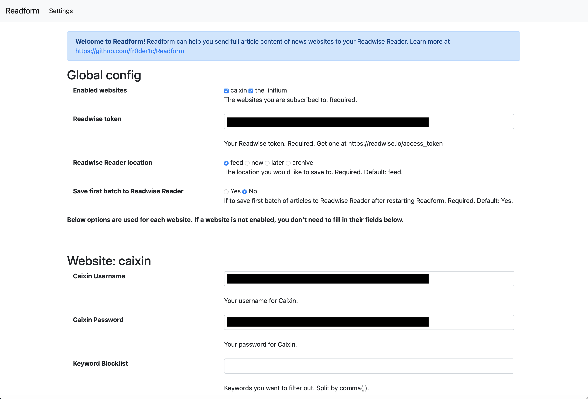

# Readform
[Chinese version](./README_ZH.md)

**Important**: Readform 1.0.0 is now released with significant updates. This version has **completely rewritten** the entire codebase in Go language, replaced selenium with chromedp, and optimized database performance. We anticipate that this refactoring will make the program **more robust and reliable**. As some configuration fields have been adjusted and the database has been optimized, if you have been using Readform before version 1.0.0, we suggest you **delete the data directory** when upgrading and start using Readform from scratch.


---------
This program delivers the **full article content** from paywalled news websites directly to your [Readwise Reader](https://readwise.io/read) feed, assisting in creating a unified reading workflow. Support for RSS feed output may be added in the future.

Currently supported websites:
- The initium (端传媒)
- Caixin (财新)
- Financial Times (FT)

Will be supported in the future:
- WSJ（Wall street journal)
- FTChinese（FT中文网）

## Why I built Readform
There's an abundance of high-quality, subscription-based media available on the market, and I have great respect for their work. However, I firmly believe that subscribers should have the freedom to consume content in the format they prefer, such as via an RSS reader. Professional readers often have their own customized reading workflows, and premium media that charge for their content should respect this choice.

Since these websites do not officially support full-article RSS feeds, I took it upon myself to create my own solution. At present, I use Readwise Reader as my RSS reader and have integrated it accordingly. However, I may also add support for RSS output in the future.

The ultimate aim of this project is to encourage these websites to offer official full-content RSS feeds for their subscribers. Until that happens, let's make the most of this program!

## How it works
The program continuously retrieves the latest articles using the website's official RSS feed (or 3rd party RSS feed link, if no official RSS is provided). When new articles are detected, it emulates a browser and logs in with your credentials to access the full HTML content. Any lazy-loading images will be appropriately managed, ensuring no images are missing. The program will then forward the article URL and its HTML content to Readwise Reader via the official Reader API, making them available in your feed section.


## Quick start
Readform is not a cloud-based service; rather, it operates on your own device. This approach ensures maximum security, as your username and password are required to use the program. You can install Readform on a local device such as a PC, Mac, NAS, Raspberry Pi, etc., or you can deploy it on a Virtual Private Server (VPS).

Running in Docker is the recommended way to use Readform. If you don't have Docker on your computer, you can [download it here](https://docs.docker.com/get-docker/).

1. To run this program in Docker, you can use the following command in your terminal:
    ```commandline
    docker run --restart=always -d -p 5000:5000\
        -v [your-local-empty-path]:/var/app/data fr0der1c/readform:latest
    ```
   The `-v` parameter is used to bind a local directory to the application's data directory within the Docker container. This is crucial for persisting data and maintaining states, such as articles saved to the Reader. However, if you're only interested in a quick functionality test, it's acceptable to omit this part.
2. Visit http://localhost:5000 and configure Readform via web UI.
   
3. You're all set. New articles will now appear in your Reader feed section. If you encounter any issues, you can check the logs using the `docker logs [container-id]` command. As this is a relatively new project, it may contain some bugs. If you notice any abnormal logs, crashes, or partial content, please don't hesitate to submit an issue!

## FAQ
### Is a subscription required for using this program?
This project is entirely free and open source. However, it's important to note that **you must be a subscriber to a website to access its full article content**. We do not directly provide accounts or full article content, as it's crucial to financially support the press and authors to ensure their continued operations.

### Does this project bypasses paywall?
No, this project is intended to enhance the workflow for professional readers, not to bypass paywalls. You are required to use your own credentials to log into websites.

### Is it safe to hand over my password?
Yes, the program operates on your computer and your password will always remain local. We do not have servers and we do not collect usernames and passwords. The program only makes necessary network requests to the sites you are subscribed to, and your password will only be used on these sites.

### What if the website I wanted is not supported?
While I don't intend to support all paywalled websites as this project is primarily designed to enhance my own reading workflow, the project does offer user-friendly interfaces. This makes it easy for you to add a website `Agent` as per your needs. Pull requests are always welcome!

## Disclaimer
By using this code, you are deemed to agree with the following statements:

This project is intended **solely for personal use** with the aim of enhancing the reading experience. It merely automates user actions on the user's behalf and **does not in any way breach any restrictions set by the website's owner**. Use at your own risk.